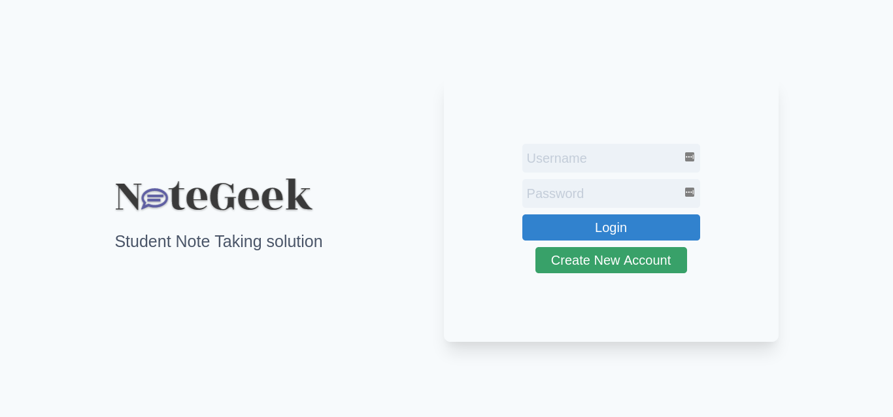

# NoteGeek

## Description

Basic Flask Application with session management and SQLite database. Users can create multiple private notes. The notes can be modified or deleted by the user.



## Features

- User Sign Up and Login
- Session management
- Same username cannot be created
- Private Notes (users can't view other user notes)
- CRUD Notes
- Latest modified notes are viewed at first

## Technologies Used

- Flask Micro-framework
- Tailwind CSS
- SQLite as Database

## Usage

```sh
$ pip install -r requirements.txt
```

```sh
$ python app.py
```

## Drawbacks

- Database Failure: New database is created every time the server restart.
- No proper validation system in forms

## Status

Status: Completed
